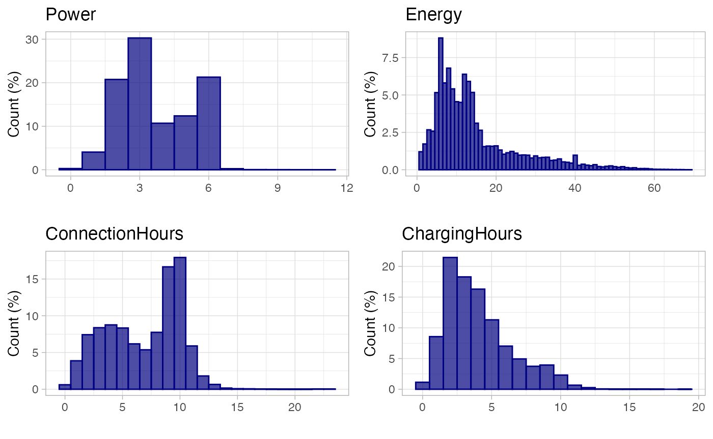

# California case study

## Data exploratory analysis

This case study is based on the open-access data from the California
Technological Institute (Caltech) through the ACN Portal initiative. You
can download the ACN data set, a collection of EV charging sessions
collected at Caltech and NASA’s Jet Propulsion Laboratory (JPL),from the
[ACN-Data website](https://ev.caltech.edu/dataset). For more information
visit the [ACN
documentation](https://acnportal.readthedocs.io/en/latest/).

This data set has been transformed to the [standard data
format](https://mcanigueral.github.io/evprof/articles/sessions-format.html)
defined by `evprof` and provided together with the package:

``` r

sessions <- evprof::california_ev_sessions
```

    ## # A tibble: 30,114 × 12
    ##    Session ConnectionStartDateTime ConnectionEndDateTime ChargingStartDateTime
    ##    <chr>   <dttm>                  <dttm>                <dttm>               
    ##  1 S1      2018-10-08 06:25:00     2018-10-08 17:06:00   2018-10-08 06:25:00  
    ##  2 S2      2018-10-08 06:35:00     2018-10-08 17:44:00   2018-10-08 06:35:00  
    ##  3 S3      2018-10-08 06:59:00     2018-10-08 17:28:00   2018-10-08 06:59:00  
    ##  4 S4      2018-10-08 07:07:00     2018-10-08 17:13:00   2018-10-08 07:07:00  
    ##  5 S5      2018-10-08 07:07:00     2018-10-08 17:22:00   2018-10-08 07:07:00  
    ##  6 S6      2018-10-08 07:20:00     2018-10-08 17:37:00   2018-10-08 07:20:00  
    ##  7 S7      2018-10-08 07:20:00     2018-10-08 17:51:00   2018-10-08 07:20:00  
    ##  8 S8      2018-10-08 07:27:00     2018-10-08 18:02:00   2018-10-08 07:27:00  
    ##  9 S9      2018-10-08 07:34:00     2018-10-08 17:20:00   2018-10-08 07:34:00  
    ## 10 S10     2018-10-08 07:36:00     2018-10-08 17:09:00   2018-10-08 07:36:00  
    ## # ℹ 30,104 more rows
    ## # ℹ 8 more variables: ChargingEndDateTime <dttm>, Power <dbl>, Energy <dbl>,
    ## #   ConnectionHours <dbl>, ChargingHours <dbl>, FlexibilityHours <dbl>,
    ## #   ChargingStation <chr>, UserID <chr>

For this use case we have to configure the `evprof` global variable
(connections start time) with the following values:

``` r

options(
  evprof.start.hour = 3
)
```

### Data set visualization

The ACN charging sessions open data set contains 30114 sessions, from
2018-10-08 06:25:00 to 2021-09-13 22:44:00.

``` r

plot_points(sessions, size = 0.5)
```


### Statistic analysis

The average values of the most important features in our charging
sessions data set are:

``` r

summarise_sessions(sessions, mean) %>% 
  knitr::kable(digits = 2)
```

| Power | Energy | ConnectionHours | ChargingHours |
|------:|-------:|----------------:|--------------:|
|  3.72 |  14.68 |            6.89 |          4.06 |

``` r

plot_histogram_grid(sessions)
```



## Data preprocessing

### Divide the data

#### Division by Disconnection day

``` r

plot_points(sessions, size = 0.25) %>% 
  plot_division_lines(n_lines = 1, division_hour = 6)
```


``` r

sessions_divisions <- sessions %>% 
  divide_by_disconnection(division_hour = 6) %>% 
  drop_na(Disconnection)
```

| Disconnection day | Number of sessions | Percentage of sessions (%) |
|------------------:|-------------------:|---------------------------:|
|                 1 |              29294 |                      97.28 |
|                 2 |                820 |                       2.72 |

#### Time-cycle division

Sessions distribution by day of the week:

``` r

plot_density_2D(sessions_divisions, bins = 20, by = 'wday')
```


Sessions distribution by month:

``` r

plot_density_2D(sessions_divisions, bins = 20, by = 'month')
```


``` r

sessions_divisions <- sessions_divisions %>% 
  divide_by_timecycle(months_cycles = list(1:12), wdays_cycles = list(1:5, 6:7))
```

| Time-cycle | Number of sessions | Percentage of sessions (%) |
|:-----------|-------------------:|---------------------------:|
| 1          |              29367 |                      97.52 |
| 2          |                747 |                       2.48 |

#### Divided data set

Since the sessions disconnecting the day after the connection are not
relevant (\<2%) we will filter only sessions with
`Disconnection == "1"`. Then we change the `Timecycle` values from 1 and
2 to Workday and Weekend, respectively.

``` r

sessions_divided <- sessions_divisions %>% 
  filter(Disconnection == "1") %>%
  mutate(
    Timecycle = plyr::mapvalues(Timecycle, c("1", "2"), c("Workday", "Weekend")),
    Timecycle = factor(Timecycle, levels = c("Workday", "Weekend"))
  ) %>% 
  select(-Disconnection)

head(sessions_divided)
```

### Data cleaning

Let’s see if we have outliers for working days:

``` r

sessions_divided %>% 
  filter(Timecycle == "Workday") %>% 
  plot_points(log = T, size = 0.5)
```


We will cut sessions that start before 1.5 in the logarithmic scale:

``` r

sessions_divided %>% 
  filter(Timecycle == "Workday") %>% 
  cut_sessions(connection_start_min = 1.5, connection_hours_min = -1, log = T) %>% 
  plot_points(log = T, size = 0.5)
```


From this point, it is necessary to iterate over different parameters in
`detect_outliers` function to detect the visible outliers through
function `plot_outliers`. In this case we were happy with `MinPts = 50`
and `noise_th = 2.5`.

``` r

sessions_workday_noise <- sessions_divided %>% 
  filter(Timecycle == "Workday") %>%
  cut_sessions(connection_start_min = 1.5, connection_hours_min = -1.5, log = T) %>% 
  detect_outliers(noise_th = 2, log = T, MinPts = 100) 
```

``` r

sessions_workday_noise %>%
  plot_outliers(log = T, size = 0.5)
```


``` r

sessions_workday <- sessions_workday_noise %>% 
  drop_outliers()
```

Let’s repeat the same process for weekends:

``` r

sessions_divided %>% 
  filter(Timecycle == "Weekend") %>% 
  plot_points(log = T, size = 0.5)
```


We will also cut sessions that start before 1.5 in the logarithmic
scale., but in this case we consider not necessary to detect outliers
with dbscan.

``` r

sessions_divided %>% 
  filter(Timecycle == "Weekend") %>% 
  cut_sessions(connection_start_min = 1.5, connection_hours_min = 0, log = TRUE) %>% 
  plot_points(size = 0.5, log = T)
```


``` r

sessions_weekend <- sessions_divided %>% 
  filter(Timecycle == "Weekend") %>% 
  cut_sessions(connection_start_min = 1.8, connection_hours_min = 0, log = TRUE)
```

The 3D density plot of Workday sessions in logarithmic scale:

``` r

plot_density_3D(sessions_workday, log = T)
```

The 3D density plot of Weekend sessions in logarithmic scale:

``` r

plot_density_3D(sessions_weekend, log = T)
```

## Clustering process

### Parameters selection

After generating a BIC plot for each one of the 8 sub-sets, the selected
number of clusters are:

- Sessions workday: `k = 6`
- Sessions weekend: `k = 2`

Then, each data sub-set has been clustered 6 times and the optimal seeds
for each sub-set have resulted as follows:

- Sessions workday: `seed = 823`
- Sessions weekend: `seed = 484`

### Clustering

``` r

workday_GMM <- cluster_sessions(sessions_workday, k = 6, seed = 823, log = T)
weekend_GMM <- cluster_sessions(sessions_weekend, k = 2, seed = 484, log = T)
```

``` r

bivarGMM_plots <- purrr::map2(
  list(workday_GMM$sessions, weekend_GMM$sessions),
  list(workday_GMM$models, weekend_GMM$models),
  ~ plot_bivarGMM(
    .x, .y, profiles_names = paste0(.y$cluster, " (", round(.y$ratio*100), "%)"), log = T, legend_nrow = 1
  )
)
```

## Profiling

### Workday sessions

For workdays’ sessions we differentiate between full-time Workers and
Visitors that can connect during the morning, the afternoon or the
evening. Basically, the Visit user profile has been assigned to the
other clusters that are not connecting during the usual working time.


``` r

# Define clusters
workday_clusters_profiles <- define_clusters(
  models = workday_GMM$models,
  interpretations = c(
    "Full-day workers",
    "Full-day or morning visitors",
    "Evening visits",
    "Full-day workers",
    "Full-day workers",
    "Afternoon visits"
  ),
  profile_names = c(
    "Worktime",
    "Visit",
    "Visit",
    "Worktime",
    "Worktime",
    "Visit"
  ),
  log = T
)

workday_clusters_profiles %>% 
  knitr::kable(digits = 2, col.names = c(
    "Cluster", "Controid Start time", "Centroid Connection hours", "Interpretation", "Profile"
  ))
```

| Cluster | Controid Start time | Centroid Connection hours | Interpretation | Profile |
|:---|:---|---:|:---|:---|
| 1 | 07:19 | 9.75 | Full-day workers | Worktime |
| 2 | 12:13 | 4.73 | Full-day or morning visitors | Visit |
| 3 | 07:26 | 4.66 | Evening visits | Visit |
| 4 | 07:19 | 8.90 | Full-day workers | Worktime |
| 5 | 06:33 | 9.64 | Full-day workers | Worktime |
| 6 | 15:19 | 2.45 | Afternoon visits | Visit |

### Weekend sessions

In this case we consider that all clusters belong to a Visitor
behaviour.

``` r

bivarGMM_plots[[2]]
```


``` r

# Define clusters
weekend_clusters_profiles <- define_clusters(
  models = weekend_GMM$models,
  interpretations = c(
    "Morning visitors",
    "Afternoon visits"
  ),
  profile_names = c(
    "Visit",
    "Visit"
  ),
  log = T
)

weekend_clusters_profiles %>% 
  knitr::kable(digits = 2, col.names = c(
    "Cluster", "Controid Start time", "Centroid Connection hours", "Interpretation", "Profile"
  ))
```

| Cluster | Controid Start time | Centroid Connection hours | Interpretation | Profile |
|:---|:---|---:|:---|:---|
| 1 | 07:33 | 7.23 | Morning visitors | Visit |
| 2 | 11:17 | 3.55 | Afternoon visits | Visit |

## Sessions classification into user profiles

``` r

# Join the classification of each subset
sessions_profiles <- set_profiles(
  sessions_clustered = list(workday_GMM$sessions, weekend_GMM$sessions),
  clusters_definition = list(workday_clusters_profiles, weekend_clusters_profiles)
)

head(sessions_profiles)
```

    ## # A tibble: 6 × 15
    ##   Profile  Session ConnectionStartDateTime ConnectionEndDateTime
    ##   <chr>    <chr>   <dttm>                  <dttm>               
    ## 1 Worktime S1      2018-10-08 06:25:00     2018-10-08 17:06:00  
    ## 2 Worktime S2      2018-10-08 06:35:00     2018-10-08 17:44:00  
    ## 3 Worktime S3      2018-10-08 06:59:00     2018-10-08 17:28:00  
    ## 4 Worktime S4      2018-10-08 07:07:00     2018-10-08 17:13:00  
    ## 5 Worktime S5      2018-10-08 07:07:00     2018-10-08 17:22:00  
    ## 6 Worktime S6      2018-10-08 07:20:00     2018-10-08 17:37:00  
    ## # ℹ 11 more variables: ChargingStartDateTime <dttm>,
    ## #   ChargingEndDateTime <dttm>, Power <dbl>, Energy <dbl>,
    ## #   ConnectionHours <dbl>, ChargingHours <dbl>, FlexibilityHours <dbl>,
    ## #   ChargingStation <chr>, UserID <chr>, Timecycle <fct>, Cluster <chr>

``` r

classification_profiles_plot <- plot_points(sessions_profiles, start = 3, log = FALSE, aes(color = Profile), size = 0.3) + 
  facet_wrap(~ Timecycle)

classification_profiles_plot
```


## User profiles modeling

### Workdays models

Connection models: Bi-variate Gaussian Mixture Models

``` r

# Build the models
workday_connection_models <- get_connection_models(list(workday_GMM), list(workday_clusters_profiles))
```

``` r

# Plot the bivariate GMM
workday_connection_models_plot <- plot_connection_models(
  list(workday_GMM), list(workday_clusters_profiles), 
  workday_connection_models[c("profile", "ratio")]
)
```


Energy models: Uni-variate Gaussian Mixture Models

``` r

# Build the models
workday_energy_models <- sessions_profiles %>% 
  filter(Timecycle == 'Workday') %>% 
  get_energy_models(
    log = TRUE,
    by_power = FALSE
  )
```

``` r

# Plot the univariate GMM
workday_energy_models_plots <- plot_energy_models(workday_energy_models)
```


### Weekends models

Connection models: Bi-variate Gaussian Mixture Models

``` r

# Build the models
weekend_connection_models <- get_connection_models(list(weekend_GMM), list(weekend_clusters_profiles))
```

``` r

# Plot the bivariate GMM
weekend_connection_models_plot <- plot_connection_models(
  list(weekend_GMM), list(weekend_clusters_profiles), 
  weekend_connection_models[c("profile", "ratio")]
)
```


Energy models: Uni-variate Gaussian Mixture Models

``` r

# Build the models
weekend_energy_models <- sessions_profiles %>% 
  filter(Timecycle == 'Weekend') %>% 
  get_energy_models(
    log = TRUE,
    by_power = FALSE
  )
```

``` r

# Plot the univariate GMM
weekend_energy_models_plot <- plot_energy_models(weekend_energy_models, nrow = 1)
```


### Save the EV models

``` r

ev_model <- get_ev_model(
  names = c('Workday', 'Weekend'), 
  months_lst = list(1:12), 
  wdays_lst = list(1:5, 6:7),
  connection_GMM = list(workday_connection_models, weekend_connection_models),
  energy_GMM = list(workday_energy_models, weekend_energy_models),
  connection_log = T,
  energy_log = T,
  data_tz = "America/Los_Angeles"
)

ev_model
```

    ## EV sessions model of class "evmodel", created on 2025-12-19 
    ## Timezone of the model: America/Los_Angeles 
    ## The Gaussian Mixture Models of EV user profiles are built in:
    ##   - Connection Models: logarithmic scale
    ##   - Energy Models: logarithmic scale
    ## 
    ## Model composed by 2 time-cycles:
    ##   1. Workday:
    ##      Months = 1-12, Week days = 1-5
    ##      User profiles = Visit, Worktime
    ##   2. Weekend:
    ##      Months = 1-12, Week days = 6-7
    ##      User profiles = Visit

Then we can save the object to a JSON file with:

``` r

save_ev_model(ev_model, 'california_data/california_evmodel.json')
```

## Compare BAU and simulated demand

``` r

library(dygraphs)
library(lubridate)
library(evsim) # install.packages('evsim')
```

``` r

interval_mins <- 15
start_date <- dmy_hm(090920190000, tz = "America/Los_Angeles") # Monday
end_date <-  dmy_hm(290920190000, tz = "America/Los_Angeles") + days(1) # Sunday
dttm_seq <- seq.POSIXt(from = start_date, to = end_date, by = paste(interval_mins, 'min'))

sessions_demand <- sessions_profiles %>% 
  filter(between(ConnectionStartDateTime, start_date - days(1), end_date))

demand <- sessions_demand %>% 
  evsim::get_demand(dttm_seq)
```

We can plot the time-series demand with function
[`evsim::plot_ts`](https://resourcefully-dev.github.io/evsim/reference/plot_ts.html):

``` r

demand %>% 
  evsim::plot_ts(fillGraph = T)
```

To simulate an equivalent type of sessions we have to find the following
parameters:

- **Charging rates distribution**: We can get the current charging power
  distribution with function
  [`get_charging_rates_distribution()`](https://resourcefully-dev.github.io/evprof/reference/get_charging_rates_distribution.md):

``` r

charging_rates <- get_charging_rates_distribution(sessions_demand) %>% 
  select(power, ratio)

print(charging_rates)
```

    ## # A tibble: 450 × 2
    ##    power   ratio
    ##    <dbl>   <dbl>
    ##  1  0.13 0.00103
    ##  2  0.19 0.00103
    ##  3  0.2  0.00103
    ##  4  0.24 0.00103
    ##  5  0.29 0.00103
    ##  6  0.38 0.00103
    ##  7  0.46 0.00103
    ##  8  0.48 0.00206
    ##  9  0.49 0.00103
    ## 10  0.5  0.00103
    ## # ℹ 440 more rows

- **Number of sessions per day**: The daily number of sessions for each
  time cycle

``` r

n_sessions <- sessions_demand %>% 
  group_by(Timecycle) %>% 
  summarise(n = n()) %>% 
  mutate(n_day = round(n/c(20, 8))) %>% # Divided by the monthly days of each time-cycle
  select(time_cycle = Timecycle, n_sessions = n_day)

print(n_sessions)
```

    ## # A tibble: 2 × 2
    ##   time_cycle n_sessions
    ##   <fct>           <dbl>
    ## 1 Workday            47
    ## 2 Weekend             2

- **Profiles distribution**: The user profiles proportion for each time
  cycle

``` r

profiles_ratios <- sessions_demand %>% 
  group_by(Timecycle, Profile) %>% 
  summarise(n = n()) %>% 
  mutate(ratio = n/sum(n)) %>% 
  select(time_cycle = Timecycle, profile = Profile, ratio) %>% 
  ungroup()

print(profiles_ratios)
```

    ## # A tibble: 3 × 3
    ##   time_cycle profile  ratio
    ##   <fct>      <chr>    <dbl>
    ## 1 Workday    Visit    0.393
    ## 2 Workday    Worktime 0.607
    ## 3 Weekend    Visit    1

Simulate new EV sessions with function
[`simulate_sessions()`](https://resourcefully-dev.github.io/evsim/reference/simulate_sessions.html)
from package [evsim](https://github.com/resourcefully-dev/evsim/):

``` r

sessions_estimated <- simulate_sessions(
  evmodel = ev_model,
  sessions_day = n_sessions,
  user_profiles = profiles_ratios,
  charging_powers = charging_rates, 
  dates = unique(date(dttm_seq)), 
  resolution = interval_mins
)
```

    ## # A tibble: 6 × 11
    ##   Session Timecycle Profile  ConnectionStartDateTime ConnectionEndDateTime
    ##   <chr>   <chr>     <chr>    <dttm>                  <dttm>               
    ## 1 S1      Workday   Visit    2019-09-09 05:00:00     2019-09-09 14:20:00  
    ## 2 S2      Workday   Worktime 2019-09-09 06:00:00     2019-09-09 15:00:00  
    ## 3 S3      Workday   Worktime 2019-09-09 06:00:00     2019-09-09 16:07:00  
    ## 4 S4      Workday   Visit    2019-09-09 06:00:00     2019-09-09 13:17:00  
    ## 5 S5      Workday   Visit    2019-09-09 06:15:00     2019-09-09 15:28:00  
    ## 6 S6      Workday   Visit    2019-09-09 06:45:00     2019-09-09 11:50:00  
    ## # ℹ 6 more variables: ChargingStartDateTime <dttm>, ChargingEndDateTime <dttm>,
    ## #   Power <dbl>, Energy <dbl>, ConnectionHours <dbl>, ChargingHours <dbl>

Finally, we can calculate the estimated demand and compare it with the
real demand:

``` r

estimated_demand <- sessions_estimated %>% 
  get_demand(dttm_seq)
  
comparison_demand <- tibble(
  datetime = dttm_seq,
  demand_real = rowSums(demand[-1]),
  demand_estimated = rowSums(estimated_demand[-1])
) 
```

``` r

comparison_demand %>% 
  plot_ts(ylab = 'kW') %>% 
  dygraphs::dySeries('demand_real', 'Real demand', color = 'black', strokePattern = 'dashed', strokeWidth = 2) %>% 
  dygraphs::dySeries('demand_estimated', 'Estimated demand', color = 'navy', fillGraph = T)
```

We see that from Monday to Thursday the peak demand from our simulation
corresponds quite well with the real peak demand. However, for Fridays
it is not so good, so maybe it would be convenient to consider Fridays
as a separate time-cycle instead of considering it a normal working day.
The demand on weekends is also not really accurate due to the low amount
of sessions (~ 3). Obviously, the stochastic simulations work better
with large amounts of data since the aggregation makes the random
component not so relevant.
