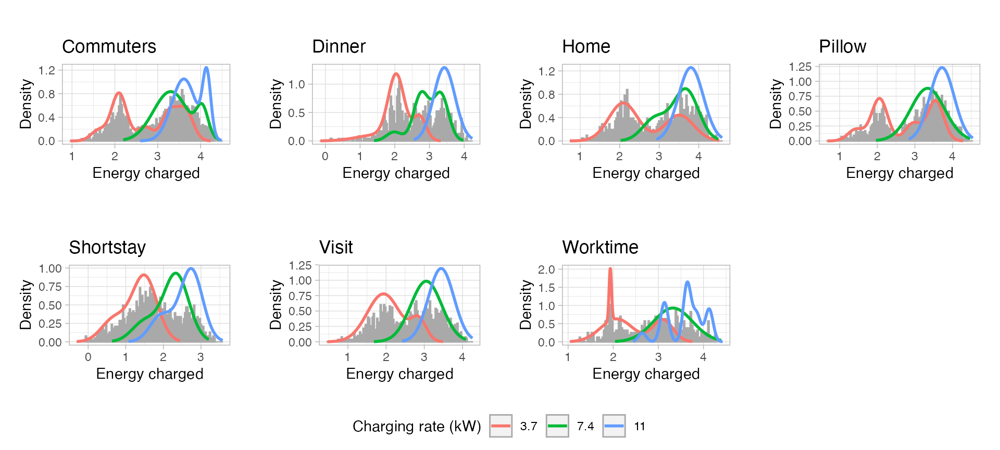
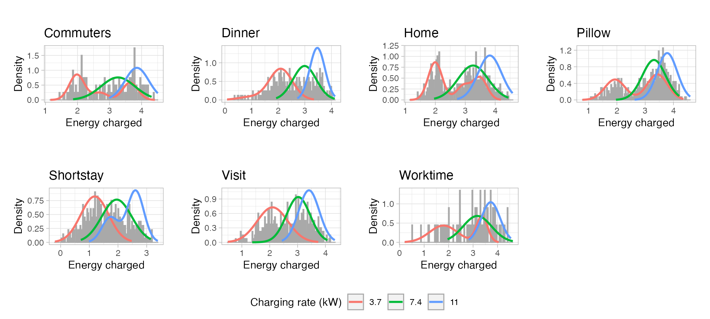
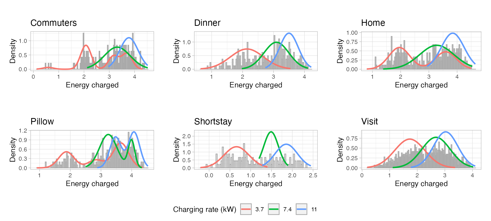
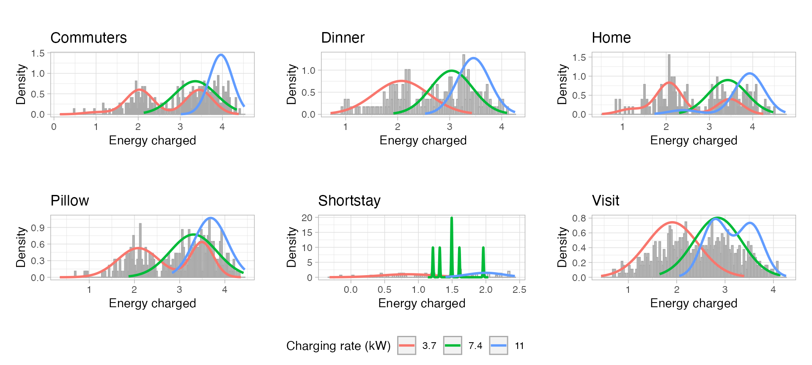

# Profiling EV users

## Introduction

This article shows the methodology used to classify EV charging sessions
among generic user profiles, using the R package
[evprof](https://github.com/resourcefully-dev/evprof/). The goal of this
analysis is to define generic **user profiles** or, in other words, **EV
connection patterns** that could relate a charging sessions to a
specific user behaviour. The most relevant variables of the data set are
the *Connection Start Time* and the *Connection Hours (duration)*. Based
on these two variables
[evprof](https://github.com/resourcefully-dev/evprof/) package aims to
provide tools to analyze, cluster and model different user profiles with
similar flexibility potential to, in a farther stage, exploit their
flexibility in specific demand response programs.

The workflow followed to perform in this tutorial is the one below:

1.  Data exploratory analysis
    1.  Data set visualization
    2.  Statistic analysis
2.  Pre-processing
    1.  Data division
    2.  Outliers cleaning
3.  Clustering
4.  Profiling
5.  Modelling
6.  Simulation
7.  Comparison of simulation with real data

This article applies the methodology proposed to a real EV data set from
a mid-sized Dutch city. However, the aim of package
[evprof](https://github.com/resourcefully-dev/evprof/) is to replicate
the same methodology to other real data sets for any other country in
the world, like the example data set of EV charging sessions provided by
`evprof` (see the [California
article](https://mcanigueral.github.io/evprof/articles/california.html)).
If you use this package don’t hesitate to comment your results with the
authors of [evprof](https://github.com/resourcefully-dev/evprof/).

## Data exploratory analysis

### Data set visualization

This charging sessions data set contains 210711 sessions, from
2015-08-31 to 2020-06-01. The variables in the data set must have the
`evprof` standard format described in
[`vignette("sessions-format")`](https://resourcefully-dev.github.io/evprof/articles/sessions-format.md).

``` r

knitr::kable(head(sessions, n = 10))
```

| Session | ConnectionStartDateTime | ConnectionEndDateTime | ChargingStartDateTime | ChargingEndDateTime | Power | Energy | ConnectionHours | ChargingHours | FlexibilityHours | ChargingStation |
|:---|:---|:---|:---|:---|---:|---:|---:|---:|---:|:---|
| 85851 | 2015-08-31 17:53:00 | 2015-09-02 07:17:00 | 2015-08-31 17:53:00 | 2015-08-31 22:18:00 | 2.231386 | 9.89 | 37.40000 | 4.4322222 | 32.967778 | NLAMSEARNH0007 |
| 86339 | 2015-09-01 15:28:00 | 2015-09-02 12:21:00 | 2015-09-01 15:28:00 | 2015-09-01 16:44:00 | 1.965202 | 2.51 | 20.88333 | 1.2772222 | 19.606111 | NLAMSEARNH0012 |
| 86305 | 2015-09-01 17:41:00 | 2015-09-02 07:06:00 | 2015-09-01 17:41:00 | 2015-09-01 22:14:00 | 2.326762 | 10.59 | 13.41667 | 4.5513889 | 8.865278 | NLAMSEARNH0036 |
| 86329 | 2015-09-01 18:08:00 | 2015-09-02 07:10:00 | 2015-09-01 18:08:00 | 2015-09-01 19:14:00 | 1.737120 | 1.92 | 13.03333 | 1.1052778 | 11.928056 | NLAMSEARNH0019 |
| 86332 | 2015-09-01 18:12:00 | 2015-09-02 08:11:00 | 2015-09-01 18:12:00 | 2015-09-01 21:39:00 | 2.816110 | 9.75 | 13.98333 | 3.4622222 | 10.521111 | NLALLEGO000328 |
| 86336 | 2015-09-01 18:19:00 | 2015-09-02 07:45:00 | 2015-09-01 18:19:00 | 2015-09-02 00:54:00 | 3.052055 | 20.13 | 13.43333 | 6.5955556 | 6.837778 | NLAMSEARNH0033 |
| 86354 | 2015-09-01 18:33:00 | 2015-09-02 07:21:00 | 2015-09-01 18:33:00 | 2015-09-01 20:44:00 | 3.481669 | 7.65 | 12.80000 | 2.1972222 | 10.602778 | NLAMSEARNH0027 |
| 86361 | 2015-09-01 19:22:00 | 2015-09-02 08:38:00 | 2015-09-01 19:22:00 | 2015-09-01 23:59:00 | 2.214286 | 10.23 | 13.26667 | 4.6200000 | 8.646667 | NLALLEGO000283 |
| 86376 | 2015-09-01 19:59:00 | 2015-09-02 07:11:00 | 2015-09-01 19:59:00 | 2015-09-01 21:54:00 | 3.403166 | 6.57 | 11.20000 | 1.9305556 | 9.269444 | NLAMSEARNH0004 |
| 86371 | 2015-09-01 20:00:00 | 2015-09-05 14:49:00 | 2015-09-01 20:00:00 | 2015-09-01 20:44:00 | 2.057527 | 1.53 | 90.81667 | 0.7436111 | 90.073056 | NLAMSEARNH0018 |

The following plot represents with a point every charging session in
hour data set, based on the two most relevant features to define a user
profile: Connection Start Time and Connection Hours (duration).

``` r

plot_points(sessions, size = 0.25)
```


As you can see, the visible “clouds” of points are not plotted in their
natural shape. They are cut because the x axis of the plot goes from
00:00 to 23:59 of a single day, while the connection patterns start from
6 AM of one day until the morning of the next day. To solve this issue,
a lot of `evprof` functions have a `start` parameter to set up the hour
from which the EV users start their connections.

``` r

plot_points(sessions, start = 6, size = 0.25)
```


This `start` parameter can be defined with a global option since most
function have the default value as
`start = getOption("evprof.start.hour")`. Since this parameter depends
on the use case, we recommend to define it at the beginning of the
analysis:

``` r

options(
  evprof.start.hour = 6
)
```

### Statistic analysis

The average values of the most important features in our charging
sessions data set are:

``` r

summarise_sessions(sessions, mean) %>% 
  knitr::kable(digits = 2)
```

| Power | Energy | ConnectionHours | ChargingHours |
|------:|-------:|----------------:|--------------:|
|  4.27 |  12.41 |            9.62 |          2.84 |

Even though average values don’t give a clear view of the sessions, in
general our data set has:

- Low charging power (new EV models can charge up to 22 kW AC), probably
  most of sessions charge with 3.7 or 7.3 kW rates.
- Low energy demand (most of models have at least 40 kWh of battery),
  probably due to the energy spent in the travel home-city.
- Long connections, probably during the night.
- Low charging hours due to low energy demand.
- High flexibility due to long connections and low energy demand.

However, the goal of analyzing different user profiles is to find groups
of sessions with different features averages. A more depth overview of
the data set in this sense can be done with a distribution plot
(histogram) of each one of these features:

``` r

plot_histogram_grid(sessions)
```


There is no feature that fits a Gaussian distribution, and some features
like `ConnectionHours` have more than one peak in the distribution
curve. This shows the existence and combination of different EV user
profiles with independent distributions.

## Data preprocessing

The clustering method used in package
[evprof](https://github.com/resourcefully-dev/evprof/) is Gaussian
Mixture Models with Expectation-Maximization algorithm, wrapping
functions from [mclust](https://mclust-org.github.io/mclust/) package.
To obtain a better performance in GMM clustering it is important to
divide the data in smaller groups and clean the outliers, since the
different density distributions will result more accentuated and easy to
model.

### Divide the data

The division is performed in two steps:

1.  Disconnection day
2.  Time-cycle behaviors

#### Disconnection day division

The different data points groups that stand out from overview plot
correspond to sessions disconnection day. With function
`plot_division_lines` we can visualize a division from a certain hour.
We will set the division line from 3:00 AM, which means that sessions
below division line disconnect before 3:00 AM of that day, each line
corresponding to a different day.

``` r

plot_points(sessions, size = 0.25) %>% 
  plot_division_lines(n_lines = 4, division_hour = 3)
```


After finding the proper hour to make the division, function
[`divide_by_disconnection()`](https://resourcefully-dev.github.io/evprof/reference/divide_by_disconnection.md)
makes this division adding an extra column to the data set,
`Disconnection`, with the number of the corresponding disconnection day.
The sessions distribution over these 5 disconnection days is:

``` r

sessions_divisions <- sessions %>% 
  divide_by_disconnection(division_hour = 3)
```

| Disconnection day | Number of sessions | Percentage of sessions (%) |
|------------------:|-------------------:|---------------------------:|
|                 1 |             107805 |                      51.16 |
|                 2 |              96980 |                      46.03 |
|                 3 |               4805 |                       2.28 |
|                 4 |                907 |                       0.43 |
|                 5 |                214 |                       0.10 |

Almost all sessions disconnect the same day or the day after the
connection since only 3% of sessions disconnect 2, 3 or 4 days after the
connection.

#### Time-cycle division

It is also important to consider the time-cycles or periods when users
change their behaviors. The function `plot_density_2D` lets to analyze
the different density of sessions (i.e. users behavior) according to
different weekday, month or year.

``` r

plot_density_2D(sessions_divisions, by = 'wday')
```


``` r

plot_density_2D(sessions_divisions, by = 'month')
```


While depending on the weekday the density of sessions is highly
diverse, between months we can’t see a big difference. Moreover, we
could see different distributions on Monday-Thursday, Friday, Saturday
and Sunday, thus we will consider four different groups: working days
(Monday - Thursday), Fridays, Saturdays, Sundays. The division for
time-cycles sessions is performed by function
[`divide_by_timecycle()`](https://resourcefully-dev.github.io/evprof/reference/divide_by_timecycle.md),
which adds an extra column `Timecycle` to the sessions data set with the
number of time-cycle according to function parameters `months_cycles`
and `wdays_cycles`.

``` r

sessions_divisions <- sessions_divisions %>% 
  divide_by_timecycle(
    months_cycles = list(1:12), 
    wdays_cycles = list(1:4, 5, 6, 7)
  )
```

| Time-cycle | Number of sessions | Percentage of sessions (%) |
|:-----------|-------------------:|---------------------------:|
| 1          |             124533 |                      59.10 |
| 2          |              30862 |                      14.65 |
| 3          |              30018 |                      14.25 |
| 4          |              25298 |                      12.01 |

#### Divided data set

Once the two division approaches are applied, our data set counts with
two extra columns (`Disconnection` and `Timecycle`) to classify each
data point within each group. These columns have integer values
corresponding to each division. For a more readable data set we can
change these integer values by character strings with the definition of
each group, and convert them to `factors` to set a specific order of the
levels.

However, in the Disconnection day division we have seen that sessions
disconnecting 2, 3 or 4 days after the connection represent just a 3% of
the total data set. Thus, for obtaining generic user profiles these
sessions will be discarded. The two *Disconnection* groups that we will
analyze are the sessions that disconnect during the same connection day,
labeled as **City sessions**, and the sessions that disconnect the day
after connection, named **Home sessions**. At the same time, each
*Time-cycle* group has the name of the corresponding weekday:
**Workday**, **Friday**, **Saturday** and **Sunday**.

``` r

sessions_divided <- sessions_divisions %>% 
  filter(Disconnection %in% c("1", "2")) %>%
  mutate(
    Disconnection = plyr::mapvalues(Disconnection, c("1", "2"), c("City", "Home")),
    Disconnection = factor(Disconnection, levels = c("City", "Home")),
    Timecycle = plyr::mapvalues(Timecycle, c("1", "2", "3", "4"), c("Workday", "Friday", "Saturday", "Sunday")),
    Timecycle = factor(Timecycle, levels = c("Workday", "Friday", "Saturday", "Sunday"))
  )

head(sessions_divided)
```

### Outliers cleaning

As explained, the clustering method used in package
[evprof](https://github.com/resourcefully-dev/evprof/) is Gaussian
Mixture Models clustering. This method is sensible to outliers since it
tries to explain as most as possible all the variance of the data. This
results to wide and low-precision Gaussian distributions (clusters).
Therefore [evprof](https://github.com/resourcefully-dev/evprof/) package
provides different functions to detect and filter outliers. At the same
time, it is also recommended to perform the clustering process in a
logarithmic scale, to include negative values to originally positive
variables. The logarithmic transformation can be done in a lot of
functions setting the `log` parameter to `TRUE`. We can visualize the
data of each subset:

``` r

plot_points(sessions_divided, size = 0.2, log = T) + 
  facet_wrap(vars(Timecycle, Disconnection), scales = 'free', ncol = 4)
```


In these plots we see that every group has several points that stand out
from most of points. These outliers can be detected specifying a **noise
threshold** (in percentage) in function
[`detect_outliers()`](https://resourcefully-dev.github.io/evprof/reference/detect_outliers.md).
This function adds a logical column `Outlier` to the sessions data set
showing if a session whether a session is considered outlier. This
classification can be visualized with function
[`plot_outliers()`](https://resourcefully-dev.github.io/evprof/reference/plot_outliers.md)
which shows the outliers in grey and the noise level (in percentage) in
the title of the graph. This `Outlier` extra column can be removed
together with outliers with function
[`drop_outliers()`](https://resourcefully-dev.github.io/evprof/reference/drop_outliers.md).
Additionally, to simply discard sessions from a certain limit in both
axis (i.e connection hours or starting hour), function
[`cut_sessions()`](https://resourcefully-dev.github.io/evprof/reference/cut_sessions.md)
filters the sessions data set according to the specified minimum and
maximum limits of the corresponding axis.

The following plots show the noise-detection process performed for the
charging sessions data set and the corresponding filtering, resulting in
8 different clean sub sets ready to be clustered.

#### Workday city sessions

``` r

swc <- sessions_divided %>% 
  filter(Disconnection == "City", Timecycle == "Workday") %>% 
  cut_sessions(connection_start_min = 1.85, connection_start_max = 3.15, log=T) %>% 
  detect_outliers(MinPts = 100, noise_th = 2, log = T)
```

``` r

swc %>% plot_outliers(log = T, size = 0.25)
```


``` r

sessions_workday_city <- swc %>% 
  drop_outliers()
```

#### Workday home sessions

``` r

swh <- sessions_divided %>% 
  filter(Disconnection == "Home", Timecycle == "Workday") %>% 
  cut_sessions(connection_hours_min = 1.5, log=T) %>% 
  detect_outliers(MinPts = 200, noise_th = 2, log = T)
```

``` r

swh %>% plot_outliers(log = T, size = 0.25)
```


``` r

sessions_workday_home <- swh %>% 
  drop_outliers()
```

#### Friday city sessions

``` r

sfc <- sessions_divided %>% 
  filter(Disconnection == "City", Timecycle == "Friday") %>% 
  detect_outliers(MinPts = 50, noise_th = 2, log = T)
```

``` r

sfc %>% plot_outliers(log = T, size = 0.25)
```


``` r

sessions_friday_city <- sfc %>% 
  drop_outliers()
```

#### Friday home sessions

``` r

sfh <- sessions_divided %>% 
  filter(Disconnection == "Home", Timecycle == "Friday") %>% 
  cut_sessions(connection_hours_min = 1.5, connection_start_min = 2.5, log=T) %>% 
  detect_outliers(MinPts = 200, noise_th = 5, log = T)
```

``` r

sfh %>% plot_outliers(log = T, size = 0.25)
```


``` r

sessions_friday_home <- sfh %>% 
  drop_outliers()
```

#### Saturday city sessions

``` r

ssac <- sessions_divided %>% 
  filter(Disconnection == "City", Timecycle == "Saturday") %>% 
  detect_outliers(MinPts = 200, noise_th = 5, log = T)
```

``` r

ssac %>% plot_outliers(log = T, size = 0.25)
```


``` r

sessions_saturday_city <- ssac %>% 
  drop_outliers()
```

#### Saturday home sessions

``` r

ssah <- sessions_divided %>% 
  filter(Disconnection == "Home", Timecycle == "Saturday") %>% 
  cut_sessions(connection_hours_min = 1.5, log=T) %>% 
  detect_outliers(MinPts = 50, noise_th = 6, log = T)
```

``` r

ssah %>% plot_outliers(log = T, size = 0.25)
```


``` r

sessions_saturday_home <- ssah %>% 
  drop_outliers()
```

#### Sunday city sessions

``` r

ssuc <- sessions_divided %>% 
  filter(Disconnection == "City", Timecycle == "Sunday") %>% 
  cut_sessions(connection_start_min = 2.2, log = T ) %>% 
  detect_outliers(MinPts = 50, noise_th = 6, log = T)
```

``` r

ssuc %>% plot_outliers(log = T, size = 0.25)
```


``` r

sessions_sunday_city <- ssuc %>% 
  drop_outliers()
```

#### Sunday home sessions

``` r

ssuh <- sessions_divided %>% 
  filter(Disconnection == "Home", Timecycle == "Sunday") %>% 
  cut_sessions(connection_hours_min = 1.5, connection_start_min = 2.3, 
               connection_start_max = 3.25, log = T) %>% 
  detect_outliers(MinPts = 200, noise_th = 5, log = T)
```

``` r

ssuh %>% plot_outliers(log = T, size = 0.25)
```


``` r

sessions_sunday_home <- ssuh %>% 
  drop_outliers()
```

## Clustering process

Function `cluster_sessions` perform a classification of sessions adding
an extra column `Cluster` with the corresponding cluster number.
However, Gaussian Mixture Models need a predefined number of clusters
`k`. Moreover, this function also requires a `seed` in order to define a
specific random seed and being able to reproduce specifics clustering
results.

### Parameters selection

The Bayesan Information Criterion (BIC) is a common approach to find the
optimal number of clusters to consider for the GMM clustering. BIC
values are an approximation to intergrated likelihood (explained
variance in data) with a penalty on the number of components, so the
‘best’ model is the one with the highest BIC among the fitted models.

To evaluate the BIC of your data sets according to the number of
components use function
[`choose_k_GMM()`](https://resourcefully-dev.github.io/evprof/reference/choose_k_GMM.md),
for example:

``` r

choose_k_GMM(sessions_workday_city, k = 3:10, log = T)
```

After generating a BIC plot for each one of the 8 sub-sets, the selected
number of clusters are:

- Sessions workday city: `k = 6`
- Sessions workday home: `k = 6`
- Sessions Friday city: `k = 6`
- Sessions Friday home: `k = 6`
- Sessions Saturday city: `k = 5`
- Sessions Saturday home: `k = 5`
- Sessions Sunday city: `k = 5`
- Sessions Sunday home: `k = 6`

Then, since Gaussian Mixture Modeling depends on the random seed of the
operation, it is recommended to repeat the clustering process several
times and observe the variability. If different clusters are obtained in
each repetition, it means that there is still too much noise or variance
in the data, or that a different number of clusters should be selected.
Function
[`save_clustering_iterations()`](https://resourcefully-dev.github.io/evprof/reference/save_clustering_iterations.md)
repeats the clustering the number of times specified in the `it`
parameter and saves the results in a PDF file. From this file, then we
can choose the optimal seed according to the BIC value. For example:

``` r

save_clustering_iterations(
  sessions_workday_city, k=6, it=6, log = T,
  filename = "figures/clusters/workday_city_k-6.pdf"
)
```

For this study case, each data sub-set has been clustered 6 times and
the optimal seeds for each sub-set have resulted as follows:

- Sessions Workday city: `seed = 91`
- Sessions Workday home: `seed = 643`
- Sessions Friday city: `seed = 311`
- Sessions Friday home: `seed = 436`
- Sessions Saturday city: `seed = 668`
- Sessions Saturday home: `seed = 537`
- Sessions Sunday city: `seed = 908`
- Sessions Sunday home: `seed = 566`

### Clustering

Finally, we can cluster each sub-set with function
[`cluster_sessions()`](https://resourcefully-dev.github.io/evprof/reference/cluster_sessions.md),
specifying the parameters `k` and `seed` with the corresponding values
previously found:

``` r

workday_city_GMM <- cluster_sessions(
  sessions_workday_city, k = 6, seed = 91, log = T
)
workday_home_GMM <- cluster_sessions(
  sessions_workday_home, k = 6, seed = 643, log = T
)
friday_city_GMM <- cluster_sessions(
  sessions_friday_city, k = 6, seed = 311, log = T
)
friday_home_GMM <- cluster_sessions(
  sessions_friday_home, k = 6, seed = 436, log = T
)
saturday_city_GMM <- cluster_sessions(
  sessions_saturday_city, k = 5, seed = 668, log = T
)
saturday_home_GMM <- cluster_sessions(
  sessions_saturday_home, k = 6, seed = 92, log = T
)
sunday_city_GMM <- cluster_sessions(
  sessions_sunday_city, k = 5, seed = 101, log = T
)
sunday_home_GMM <- cluster_sessions(
  sessions_sunday_home, k = 6, seed = 191, log = T
)
```

The object returned by
[`cluster_sessions()`](https://resourcefully-dev.github.io/evprof/reference/cluster_sessions.md)
function is a list with two other objects:

- `sessions`: a `tibble` containing the sessions’ data set with an extra
  column `Cluster` (i.e. the corresponding cluster number)
- `models`: a `tibble` with the means and co-variance matrix of each
  cluster’s Gaussian Mixture Models

These two objects correspond to the parameters `sessions` and `models`
of the function
[`plot_bivarGMM()`](https://resourcefully-dev.github.io/evprof/reference/plot_bivarGMM.md),
which plots each cluster as an ellipse over the sessions’ points. For
example:

``` r

workday_city_bivarGMM_plot <- plot_bivarGMM(
  sessions = workday_city_GMM$sessions, 
  models = workday_city_GMM$models, 
  profiles_names = paste0(
    workday_city_GMM$models$cluster, 
    " (", round(workday_city_GMM$models$ratio*100), "%)"
  ), 
  log = T, legend_nrow = 1
)
```


Using `purrr` iteration we can generate a list with a plot for each
sub-set.

``` r

bivarGMM_plots <- purrr::map2(
  list(
    workday_city_GMM$sessions, workday_home_GMM$sessions, 
    friday_city_GMM$sessions, friday_home_GMM$sessions,
    saturday_city_GMM$sessions, saturday_home_GMM$sessions, 
    sunday_city_GMM$sessions, sunday_home_GMM$sessions
  ),
  list(
    workday_city_GMM$models, workday_home_GMM$models, 
    friday_city_GMM$models, friday_home_GMM$models,
    saturday_city_GMM$models, saturday_home_GMM$models, 
    sunday_city_GMM$models, sunday_home_GMM$models
  ),
  ~ plot_bivarGMM(
    .x, .y, 
    profiles_names = paste0(.y$cluster, " (", round(.y$ratio*100), "%)"), 
    log = T, 
    legend_nrow = 1
  )
)
```

We will visualize the clusters of each subsets in Profiling section,
together with the interpretation of each cluster and the corresponding
assignation to a user profile.

## Profiling

Clusters obtained from GMM don’t give a lot of information themselves
and separately may have an unclear meaning. In this section we will
define each cluster to give them a meaning and relate them to generic
user behaviors, i.e. user profiles. Moreover, not every clusters must
correspond to a single user profile, clusters with the same or a similar
meaning can be grouped to a user profile. Thus, the combination of these
multiple Gaussian Mixture Models into a single user profile is what we
expect to result in a daily generic behavior of EV users.

As a tool to define the different clusters, function
[`define_clusters()`](https://resourcefully-dev.github.io/evprof/reference/define_clusters.md)
prints the average value of the connection start time and connection
duration (i.e. the centroid) of each cluster. If the cluster process was
performed in logarithmic scale, these values are transformed to natural
scale for a better understanding. Moreover, we can pass to the
parameters `interpretations` and `profile_names` a list of character
strings with the corresponding interpretation of the centroids
(e.g. “Connection after work-time, leaving always next morning”) and the
user profile name assigned to each interpretation (e.g. “Commuter”).

### Workdays

#### Workday city


``` r

# Define clusters
workday_city_clusters_profiles <- define_clusters(
  models = workday_city_GMM$models,
  interpretations = c(
    "Visits during the morning or whole day",
    "Short visits during the day",
    "Short visits during the evening",
    "Full-day working time",
    "Visits during the afternoon",
    "Dinner time"
  ),
  profile_names = c(
    "Visit",
    "Shortstay",
    "Shortstay",
    "Worktime",
    "Visit",
    "Dinner"
  ),
  log = T
)

workday_city_clusters_profiles %>% 
  knitr::kable(digits = 2, col.names = c(
    "Cluster", "Controid Start time", "Centroid Connection hours", 
    "Interpretation", "Profile"
  ))
```

| Cluster | Controid Start time | Centroid Connection hours | Interpretation | Profile |
|:---|:---|---:|:---|:---|
| 1 | 08:56 | 4.94 | Visits during the morning or whole day | Visit |
| 2 | 11:44 | 1.21 | Short visits during the day | Shortstay |
| 3 | 18:01 | 1.36 | Short visits during the evening | Shortstay |
| 4 | 08:26 | 8.63 | Full-day working time | Worktime |
| 5 | 13:50 | 3.08 | Visits during the afternoon | Visit |
| 6 | 18:01 | 3.20 | Dinner time | Dinner |

#### Workday home


``` r

# Define clusters
workday_home_clusters_profiles <- define_clusters(
  models = workday_home_GMM$models,
  interpretations = c(
    "Connection during the night, leaving next morning",
    "Connection after work, leaving next morning",
    "Connection during the night, not necessarily leaving next morning",
    "Connection during the afternoon, not necessarily leaving next morning",
    "Connection during the afternoon, leaving next morning",
    "Connection after work, leaving next morning"
  ),
  profile_names = c(
    "Pillow",
    "Commuters",
    "Pillow",
    "Home",
    "Home",
    "Commuters"
  ),
  log = T
)

workday_home_clusters_profiles %>% 
  knitr::kable(digits = 2, col.names = c(
    "Cluster", "Controid Start time", "Centroid Connection hours", 
    "Interpretation", "Profile"
  ))
```

| Cluster | Controid Start time | Centroid Connection hours | Interpretation | Profile |
|:---|:---|---:|:---|:---|
| 1 | 21:14 | 10.67 | Connection during the night, leaving next morning | Pillow |
| 2 | 18:20 | 13.95 | Connection after work, leaving next morning | Commuters |
| 3 | 22:15 | 11.74 | Connection during the night, not necessarily leaving next morning | Pillow |
| 4 | 18:04 | 18.17 | Connection during the afternoon, not necessarily leaving next morning | Home |
| 5 | 15:46 | 16.79 | Connection during the afternoon, leaving next morning | Home |
| 6 | 18:14 | 13.44 | Connection after work, leaving next morning | Commuters |

### Fridays

#### Friday city


``` r

# Define clusters
friday_city_clusters_profiles <- define_clusters(
  models = friday_city_GMM$models,
  interpretations = c(
    "Dinner time",
    "Visits during the afternoon",
    "Short visits during the evening",
    "Short visits during the day",
    "Full-day working time",
    "Visits during the morning or whole day"
  ),
  profile_names = c(
    "Dinner",
    "Visit",
    "Shortstay",
    "Shortstay",
    "Worktime",
    "Visit"
  ),
  log = T
)

friday_city_clusters_profiles %>% 
  knitr::kable(digits = 2, col.names = c(
    "Cluster", "Controid Start time", "Centroid Connection hours", 
    "Interpretation", "Profile"
  ))
```

| Cluster | Controid Start time | Centroid Connection hours | Interpretation | Profile |
|:---|:---|---:|:---|:---|
| 1 | 18:09 | 3.36 | Dinner time | Dinner |
| 2 | 13:18 | 3.00 | Visits during the afternoon | Visit |
| 3 | 17:12 | 1.20 | Short visits during the evening | Shortstay |
| 4 | 11:09 | 1.15 | Short visits during the day | Shortstay |
| 5 | 08:51 | 8.14 | Full-day working time | Worktime |
| 6 | 09:05 | 4.14 | Visits during the morning or whole day | Visit |

#### Friday home


``` r

# Define clusters
friday_home_clusters_profiles <- define_clusters(
  models = friday_home_GMM$models,
  interpretations = c(
    "Connection during the night, not necessarily leaving next morning",
    "Connection during the night, leaving during next morning",
    "Connection after work, leaving during next morning",
    "Connection during the night, not necessarily leaving next morning",
    "Connection during the afternoon, leaving next morning",
    "Connection during the afternoon, not necessarily leaving next morning"
  ),
  profile_names = c(
    "Pillow",
    "Pillow",
    "Commuters",
    "Pillow",
    "Home",
    "Home"
  ),
  log = T
)

friday_home_clusters_profiles %>% 
  knitr::kable(digits = 2, col.names = c(
  "Cluster", "Controid Start time", "Centroid Connection hours", 
  "Interpretation", "Profile"
  ))
```

| Cluster | Controid Start time | Centroid Connection hours | Interpretation | Profile |
|:---|:---|---:|:---|:---|
| 1 | 23:51 | 11.67 | Connection during the night, not necessarily leaving next morning | Pillow |
| 2 | 21:04 | 12.18 | Connection during the night, leaving during next morning | Pillow |
| 3 | 18:15 | 15.25 | Connection after work, leaving during next morning | Commuters |
| 4 | 20:44 | 14.76 | Connection during the night, not necessarily leaving next morning | Pillow |
| 5 | 14:48 | 19.78 | Connection during the afternoon, leaving next morning | Home |
| 6 | 17:43 | 18.26 | Connection during the afternoon, not necessarily leaving next morning | Home |

Notes:

- The Friday Home cluster that leave next day is not so narrow
  (concentrated) than Workday Home cluster since people has no timetable
  on weekends morning.
- The Commuter profile on Fridays is different than Workdays Commuter
  since the after-work sessions are more dispersed in terms of both
  starting time and duration. This could be a result of not working on
  Friday afternoon (or leave early from work) and not having to leave
  early next morning.

### Saturdays

#### Saturday city


``` r

# Define clusters
saturday_city_clusters_profiles <- define_clusters(
  models = saturday_city_GMM$models,
  interpretations = c(
    "Short visits during the day",
    "Visits during the day",
    "Visits during the afternoon",
    "Visits during the morning",
    "Dinner time"
  ),
  profile_names = c(
    "Shortstay",
    "Visit",
    "Visit",
    "Visit",
    "Dinner"
  ),
  log = T
)

saturday_city_clusters_profiles %>% 
  knitr::kable(digits = 2, col.names = c(
    "Cluster", "Controid Start time", "Centroid Connection hours", 
    "Interpretation", "Profile"
  ))
```

| Cluster | Controid Start time | Centroid Connection hours | Interpretation | Profile |
|:---|:---|---:|:---|:---|
| 1 | 13:21 | 0.64 | Short visits during the day | Shortstay |
| 2 | 11:57 | 5.59 | Visits during the day | Visit |
| 3 | 14:12 | 2.08 | Visits during the afternoon | Visit |
| 4 | 10:22 | 1.79 | Visits during the morning | Visit |
| 5 | 18:02 | 3.68 | Dinner time | Dinner |

Notes:

- Shortstay profile is in minority during Saturdays in favour to Visit
  profile, probably because people have time to make longer visits
  rather than short ones.

#### Saturday home


``` r

# Define clusters
saturday_home_clusters_profiles <- define_clusters(
  models = saturday_home_GMM$models,
  interpretations = c(
    "Connection during the noon, leaving next morning",
    "Connection during the early-afternoon, leaving next morning",
    "Connection during the night, leaving next morning",
    "Connection during the night, not necessarily leaving next morning",
    "Connection during the night, leaving next morning",
    "Connection during the afternoon, not necessarily leaving next morning"
  ),
  profile_names = c(
    "Commuters", 
    "Home", 
    "Pillow",
    "Pillow",
    "Pillow",
    "Home"
  ),
  log = T
)

saturday_home_clusters_profiles %>% 
  knitr::kable(digits = 2, col.names = c(
    "Cluster", "Controid Start time", "Centroid Connection hours", 
    "Interpretation", "Profile"
  ))
```

| Cluster | Controid Start time | Centroid Connection hours | Interpretation | Profile |
|:---|:---|---:|:---|:---|
| 1 | 18:00 | 16.21 | Connection during the noon, leaving next morning | Commuters |
| 2 | 12:38 | 23.07 | Connection during the early-afternoon, leaving next morning | Home |
| 3 | 21:14 | 13.68 | Connection during the night, leaving next morning | Pillow |
| 4 | 23:49 | 13.50 | Connection during the night, not necessarily leaving next morning | Pillow |
| 5 | 23:52 | 9.82 | Connection during the night, leaving next morning | Pillow |
| 6 | 16:58 | 19.91 | Connection during the afternoon, not necessarily leaving next morning | Home |

Notes:

- The Friday Home cluster that leave next day is not so narrow
  (concentrated) than Workday Home cluster since people has no timetable
  on weekends morning. The weekends user profiles are more variable and
  less clear.
- On weekends we don’t have commuters since they don’t go from work to
  home, thus the afternoon sessions belong now to Home profile.

### Sundays

#### Sunday city


``` r

# Define clusters
sunday_city_clusters_profiles <- define_clusters(
  models = sunday_city_GMM$models,
  interpretations = c(
    "Visits during the morning or whole day",
    "Visits during the morning",
    "Visits during the day",
    "Short visits during the day",
    "Dinner time"
  ),
  profile_names = c(
    "Visit",
    "Visit",
    "Visit",
    "Shortstay",
    "Dinner"
  ),
  log = T
)

sunday_city_clusters_profiles %>% 
  knitr::kable(digits = 2, col.names = c(
    "Cluster", "Controid Start time", "Centroid Connection hours", 
    "Interpretation", "Profile"
  ))
```

| Cluster | Controid Start time | Centroid Connection hours | Interpretation | Profile |
|:---|:---|---:|:---|:---|
| 1 | 12:48 | 5.56 | Visits during the morning or whole day | Visit |
| 2 | 10:07 | 1.77 | Visits during the morning | Visit |
| 3 | 13:41 | 2.17 | Visits during the day | Visit |
| 4 | 13:35 | 0.78 | Short visits during the day | Shortstay |
| 5 | 17:19 | 3.21 | Dinner time | Dinner |

Notes:

- Shortstay visits are less relevant during the Sunday since the shops
  or places to make short assignments are closed on this weekday.
- The Dinner profile has more weight here (20%) than the other
  time-cycles (around 15%)

#### Sunday home


``` r

# Define clusters
sunday_home_clusters_profiles <- define_clusters(
  models = sunday_home_GMM$models,
  interpretations = c(
    "Connection during the afternoon, not necessarily leaving next morning",
    "Connection during the afternoon, leaving next morning",
    "Connection during the afternoon, leaving next morning",
    "Connection during the night, leaving next morning",
    "Connection during the night, not necessarily leaving next morning",
    "Connection during the afternoon, leaving next morning"
  ),
  profile_names = c(
    "Home",
    "Home",
    "Commuters",
    "Pillow",
    "Pillow",
    "Commuters"
  ),
  log = T
)

sunday_home_clusters_profiles %>% 
  knitr::kable(digits = 2, col.names = c(
    "Cluster", "Controid Start time", "Centroid Connection hours", 
    "Interpretation", "Profile"
  ))
```

| Cluster | Controid Start time | Centroid Connection hours | Interpretation | Profile |
|:---|:---|---:|:---|:---|
| 1 | 16:07 | 18.74 | Connection during the afternoon, not necessarily leaving next morning | Home |
| 2 | 14:26 | 17.64 | Connection during the afternoon, leaving next morning | Home |
| 3 | 18:07 | 13.22 | Connection during the afternoon, leaving next morning | Commuters |
| 4 | 20:56 | 10.72 | Connection during the night, leaving next morning | Pillow |
| 5 | 20:34 | 13.39 | Connection during the night, not necessarily leaving next morning | Pillow |
| 6 | 17:22 | 14.80 | Connection during the afternoon, leaving next morning | Commuters |

Notes:

- Here we have again a narrow afternoon Home clusters that show people
  leaving next morning since Monday is a working day.
- On weekends we don’t have commuters since they don’t go from work to
  home.

## Sessions classification into user profiles

After assigning a user profile to each cluster through the clusters
definitions with function
[`define_clusters()`](https://resourcefully-dev.github.io/evprof/reference/define_clusters.md),
we can use the data frame that this function outputs as the
`clusters_definition` parameter of function
[`set_profiles()`](https://resourcefully-dev.github.io/evprof/reference/set_profiles.md).
This function wraps all sub-sets sessions and clusters definitions to
return a total sessions data set with an extra `Profile` column,
finishing with this function the user profile classification of the
charging sessions data set. The other parameter that function
[`set_profiles()`](https://resourcefully-dev.github.io/evprof/reference/set_profiles.md)
needs is the `sessions_clustered`, which is the `sessions` object from
the output of `cluster_sessions` function.

``` r

# Join the classification of each subset
sessions_profiles <- set_profiles(
  sessions_clustered = list(
    workday_city_GMM$sessions, workday_home_GMM$sessions, 
    friday_city_GMM$sessions, friday_home_GMM$sessions,
    saturday_city_GMM$sessions, saturday_home_GMM$sessions, 
    sunday_city_GMM$sessions, sunday_home_GMM$sessions
  ),
  clusters_definition = list(
    workday_city_clusters_profiles, workday_home_clusters_profiles, 
    friday_city_clusters_profiles, friday_home_clusters_profiles,
    saturday_city_clusters_profiles, saturday_home_clusters_profiles, 
    sunday_city_clusters_profiles, sunday_home_clusters_profiles
  )
)

head(sessions_profiles)
```

    ## # A tibble: 6 × 15
    ##   Profile   Session ConnectionStartDateTime ConnectionEndDateTime
    ##   <chr>     <chr>   <dttm>                  <dttm>               
    ## 1 Shortstay 86437   2015-09-02 07:35:00     2015-09-02 09:02:00  
    ## 2 Worktime  86444   2015-09-02 07:46:00     2015-09-02 15:39:00  
    ## 3 Worktime  86450   2015-09-02 08:00:00     2015-09-02 17:55:00  
    ## 4 Visit     86466   2015-09-02 08:38:00     2015-09-02 11:49:00  
    ## 5 Visit     86486   2015-09-02 08:58:00     2015-09-02 13:11:00  
    ## 6 Worktime  86492   2015-09-02 09:07:00     2015-09-02 17:33:00  
    ## # ℹ 11 more variables: ChargingStartDateTime <dttm>,
    ## #   ChargingEndDateTime <dttm>, Power <dbl>, Energy <dbl>,
    ## #   ConnectionHours <dbl>, ChargingHours <dbl>, FlexibilityHours <dbl>,
    ## #   ChargingStation <chr>, Disconnection <fct>, Timecycle <fct>, Cluster <chr>

To visualize the classification we can plot the charging sessions points
with a different color for every user profile, and separate between
time-cycle.

``` r

classification_profiles_plot <- 
  plot_points(
    sessions_profiles, start = 6, log = FALSE, 
    aes(color = Profile), size = 0.3
  ) + 
  facet_wrap(vars(Timecycle)) + 
  guides(colour = guide_legend(override.aes = list(size=2)))

classification_profiles_plot
```


Although the same user profiles names are used in all time-cycles, we
can appreciate some differences that support our approach to make a
model for each time-cycle independently:

- Worktime sessions appear with a clear shape only during working days,
  while on weekends the morning sessions are more variable and have been
  assigned to the Visit user profile. The Worktime sessions on Friday
  are the half of Worktime sessions on any other working day.
- Short-stay sessions are in minority during Weekends days since we have
  longer sessions instead, or some business places are closed.
- The Home profile present narrower cluster shapes when the next day is
  a working day (Workday and Sunday time-cycles). When users don’t have
  a defined timetable the following day, sessions are more variable in
  terms of both duration and start time.
- Dinner profile has more importance during Sundays than the other
  time-cycles.

To conclude the profiling section, we could summarize the user profiles
with the following classification based on their connections features:

- **Specific profiles**: all sessions have similar start time *and*
  connection duration
  - **Worktime**: connections start between 8:00 and 9:00, with a
    duration of 8-9 hours.
  - **Commuters**: connections start between 18:00 and 19:00, with a
    duration of 13-14 hours (leaving between 7:00-8:00 of next day)
  - **Diner**: connections start between 18:00 and 19:00, with a
    duration of 3-4 hours.
- **Semi-specific profiles**: sessions have similar start time *or*
  connection duration.
  - **Shortstay**: connection duration of 1.5 hours in average.
  - **Pillow**: connection start time from 21:00.
- **Variable profiles**: sessions with a wide range of start time and
  connection duration values
  - **Visit**: city sessions that start during all day with a variety of
    short and long connection duration.
  - **Home**: home sessions that start during all afternoon not
    necessarily leaving next day.

## User profiles modelling

As seen before, we have divided the data in two subsets considering the
time-cycles where EV user profiles change their behaviors. In this case
we have four different time cycles: Workdays, Fridays, Saturdays and
Sundays.

Each time-cycle has its own **connection models** (connection start time
and duration) based on the Gaussian Mixture Models corresponding to
every user profile. However, to estimate new charging sessions we need
to **model the energy required** as well. The energy consumed is very
sensitive to latest models of EV in the market, since the batteries and
charging rates are larger with every new model. To deal with this
variability, it is recommended to build energy models using the most
recent data in the data set. Moreover, the energy models should be done
separately according to the `Power` charging rate, since this is a
determinant variable for the value of energy charged.

Each time-cycle model will be stored in `tibbles` with the following
variables:

- `profile`: Character vector with profiles names. Each profile is a row
  in the tibble.
- `profile_ratio`: Numeric vector with the ratio or percentage of
  sessions corresponding to each profile for this time cycle, obtained
  from function
  [`get_connection_models()`](https://resourcefully-dev.github.io/evprof/reference/get_connection_models.md).
  In case of modifying these ratios, their values must be always between
  0 and 1.
- `connection_models`: List of tibbles containing the connection models
  of each profile, obtained from function
  [`get_connection_models()`](https://resourcefully-dev.github.io/evprof/reference/get_connection_models.md).
- `energy_models`: List of tibbles containing the energy models of each
  profile, obtained from function
  [`get_energy_models()`](https://resourcefully-dev.github.io/evprof/reference/get_energy_models.md).

On one hand, after obtaining the connection models (i.e. bi-variate
Gaussian Mixture Models weights, means and co-variance matrices) with
function
[`get_connection_models()`](https://resourcefully-dev.github.io/evprof/reference/get_connection_models.md),
we can visualize them with function
[`plot_connection_models()`](https://resourcefully-dev.github.io/evprof/reference/plot_connection_models.md)
which outputs a similar ellipses plot than function
[`plot_bivarGMM()`](https://resourcefully-dev.github.io/evprof/reference/plot_bivarGMM.md)
but using a different color for each user profile instead of clusters
(the clusters of a same profile have the same color now).

On the other hand, the energy models (i.e. uni-variate Gaussian Mixture
Models weights, means and variance) obtained with function
[`get_energy_models()`](https://resourcefully-dev.github.io/evprof/reference/get_energy_models.md)
can be visualized with function
[`plot_energy_models()`](https://resourcefully-dev.github.io/evprof/reference/plot_energy_models.md).
We will create an energy model for every different charging rate in
`Power` column of the data set. Therefore, to avoid overfitting, the
`Power` value of all sessions has to be rounded to the three most common
values in the charging infrastructure: 3.7 kW, 7.4 kW and 11 kW.

``` r

sessions_energy_models <- sessions_profiles %>% 
  filter(
    lubridate::year(ConnectionStartDateTime) == 2020, 
    lubridate::month(ConnectionStartDateTime) < 3
  ) %>% 
  mutate(
    Power = round_to_interval(Power, 3.7)
  )
sessions_energy_models$Power[sessions_energy_models$Power == 0] <- 3.7
sessions_energy_models$Power[sessions_energy_models$Power > 11] <- 11
```

### Workdays models

Connection models: Bi-variate Gaussian Mixture Models

``` r

# Build the models
workday_connection_models <- get_connection_models(
  subsets_clustering = list(
    workday_city_GMM, workday_home_GMM
  ),
  clusters_definition = list(
    workday_city_clusters_profiles, workday_home_clusters_profiles
  )
)
```

``` r

# Plot the bivariate GMM
workday_connection_models_plot <- plot_connection_models(
  subsets_clustering = list(
    workday_city_GMM, workday_home_GMM
  ),
  clusters_definition = list(
    workday_city_clusters_profiles, workday_home_clusters_profiles
  ),
  profiles_ratios = workday_connection_models[c("profile", "ratio")],
  log = TRUE
)
```


Energy models: Uni-variate Gaussian Mixture Models

``` r

# Build the models
workday_energy_models <- sessions_energy_models %>% 
  filter(Timecycle == 'Workday') %>% 
  get_energy_models(
    log = TRUE,
    by_power = TRUE
  )
```

``` r

# Plot the univariate GMM
workday_energy_models_plots <- plot_energy_models(workday_energy_models)
```



### Fridays models

Connection models: Bi-variate Gaussian Mixture Models

``` r

# Build the models
friday_connection_models <- get_connection_models(
  subsets_clustering = list(
    friday_city_GMM, friday_home_GMM
  ),
  clusters_definition = list(
    friday_city_clusters_profiles, friday_home_clusters_profiles
  )
)
```

``` r

# Plot the bivariate GMM
friday_connection_models_plot <- plot_connection_models(
  subsets_clustering = list(
    friday_city_GMM, friday_home_GMM
  ),
  clusters_definition = list(
    friday_city_clusters_profiles, friday_home_clusters_profiles
  ),
  profiles_ratios = friday_connection_models[c("profile", "ratio")],
  log = TRUE
)
```


Energy models: Uni-variate Gaussian Mixture Models

``` r

# Build the models
friday_energy_models <- sessions_energy_models %>% 
  filter(Timecycle == 'Friday') %>% 
  get_energy_models(
    log = TRUE,
    by_power = TRUE
  )
```

``` r

# Plot the univariate GMM
friday_energy_models_plots <- plot_energy_models(friday_energy_models)
```



### Saturdays models

Connection models: Bi-variate Gaussian Mixture Models

``` r

# Build the models
saturday_connection_models <- get_connection_models(
  subsets_clustering = list(
    saturday_city_GMM, saturday_home_GMM
  ),
  clusters_definition = list(
    saturday_city_clusters_profiles, saturday_home_clusters_profiles
  )
)
```

``` r

# Plot the bivariate GMM
saturday_connection_models_plot <- plot_connection_models(
  subsets_clustering = list(
    saturday_city_GMM, saturday_home_GMM
  ),
  clusters_definition = list(
    saturday_city_clusters_profiles, saturday_home_clusters_profiles
  ),
  profiles_ratios = saturday_connection_models[c("profile", "ratio")],
  log = TRUE
)
```


Energy models: Uni-variate Gaussian Mixture Models

``` r

# Build the models
saturday_energy_models <- sessions_energy_models %>% 
  filter(Timecycle == 'Saturday') %>% 
  get_energy_models(
    log = TRUE,
    by_power = TRUE
  )
```

``` r

# Plot the univariate GMM
saturday_energy_models_plots <- plot_energy_models(saturday_energy_models)
```



### Sundays models

Connection models: Bi-variate Gaussian Mixture Models

``` r

# Build the models
sunday_connection_models <- get_connection_models(
  subsets_clustering = list(
    sunday_city_GMM, sunday_home_GMM
  ),
  clusters_definition = list(
    sunday_city_clusters_profiles, sunday_home_clusters_profiles
  )
)
```

``` r

# Plot the bivariate GMM
sunday_connection_models_plot <- plot_connection_models(
  subsets_clustering = list(
    sunday_city_GMM, sunday_home_GMM
  ),
  clusters_definition = list(
    sunday_city_clusters_profiles, sunday_home_clusters_profiles
  ),
  profiles_ratios = sunday_connection_models[c("profile", "ratio")],
  log = TRUE
)
```


Energy models: Uni-variate Gaussian Mixture Models

``` r

# Build the models
sunday_energy_models <- sessions_energy_models %>% 
  filter(Timecycle == 'Sunday') %>% 
  get_energy_models(
    log = TRUE,
    by_power = TRUE
  )
```

``` r

# Plot the univariate GMM
sunday_energy_models_plots <- plot_energy_models(sunday_energy_models)
```



### Save the EV model

The package [evprof](https://github.com/resourcefully-dev/evprof/)
proposes a standard format for the EV model with the function
[`get_ev_model()`](https://resourcefully-dev.github.io/evprof/reference/get_ev_model.md).
This function returns an object of class `evmodel`, which can be used
then as input of [evsim](https://github.com/resourcefully-dev/evsim/)
package to simulate new sessions. The function requires the following
variables:

- `names`: Character vector with the names of the time cycle
- `months_lst`: List of numeric vectors, each observation containing the
  months of validity of each time cycle
- `wdays_lst`: List of numeric vectors, each observation containing the
  weekdays of validity (week start = 1) of each time cycle
- `connection_GMM`: List of the connection models returned by function
  [`get_connection_models()`](https://resourcefully-dev.github.io/evprof/reference/get_connection_models.md)
- `energy_GMM`List of the connection models returned by function
  [`get_energy_models()`](https://resourcefully-dev.github.io/evprof/reference/get_energy_models.md)
- `connection_log`: logical `TRUE` since we have built the connection
  models in a logarithmic scale
- `energy_log`: logical `TRUE` since we have built the energy models in
  a logarithmic scale
- `tzone`: In our case the sessions are in `Europe/Amsterdam` time-zone

``` r

ev_model <- get_ev_model(
  names = c('Workday', 'Friday', 'Saturday', 'Sunday'), 
  months_lst = list(1:12), 
  wdays_lst = list(1:4, 5, 6, 7),
  connection_GMM = list(
    workday_connection_models, friday_connection_models, 
    saturday_connection_models, sunday_connection_models
  ),
  energy_GMM = list(
    workday_energy_models, friday_energy_models, 
    saturday_energy_models, sunday_energy_models
  ),
  connection_log = T,
  energy_log = T,
  data_tz = "Europe/Amsterdam"
)

ev_model
```

    ## EV sessions model of class "evmodel", created on 2025-12-19 
    ## Timezone of the model: Europe/Amsterdam 
    ## The Gaussian Mixture Models of EV user profiles are built in:
    ##   - Connection Models: logarithmic scale
    ##   - Energy Models: logarithmic scale
    ## 
    ## Model composed by 4 time-cycles:
    ##   1. Workday:
    ##      Months = 1-12, Week days = 1-4
    ##      User profiles = Dinner, Shortstay, Visit, Worktime, Commuters, Home, Pillow
    ##   2. Friday:
    ##      Months = 1-12, Week days = 5
    ##      User profiles = Dinner, Shortstay, Visit, Worktime, Commuters, Home, Pillow
    ##   3. Saturday:
    ##      Months = 1-12, Week days = 6
    ##      User profiles = Dinner, Shortstay, Visit, Commuters, Home, Pillow
    ##   4. Sunday:
    ##      Months = 1-12, Week days = 7
    ##      User profiles = Dinner, Shortstay, Visit, Commuters, Home, Pillow

Then we can save the object to a JSON file with:

``` r

save_ev_model(ev_model, file = "arnhem_data/evmodel_arnhem.json")
```

## Compare BAU and simulated demand

To simulate new sessions with our models we will make use of package
[{evsim}](https://mcanigueral.github.io/evsim/). We need the following
data:

- Number of sessions of each model
- User profiles proportions for each model
- Charging powers proportions

We will compare the current demand with the demand obtained from our
models for a certain period, for example the two first weeks of
September 2019. The time series demand from a sessions data set can also
be obtained with `evsim` package, using function
[`evsim::get_demand()`](https://resourcefully-dev.github.io/evsim/reference/get_demand.html).

``` r

library(dygraphs)
library(lubridate)
library(evsim) # install.packages('evsim')
```

``` r

interval_mins <- 15
start_date <- dmy(01022020) %>% as_datetime(tz = "Europe/Amsterdam") %>% floor_date('day')
end_date <- dmy(29022020) %>% as_datetime(tz = "Europe/Amsterdam") %>% floor_date('day')
dttm_seq <- seq.POSIXt(from = start_date, to = end_date, by = paste(interval_mins, 'min'))

sessions_demand <- sessions_profiles %>% 
  filter(between(ConnectionStartDateTime, start_date, end_date))

demand <- sessions_demand %>% 
  get_demand(dttm_seq = dttm_seq)
```

We can plot the time-series demand with function
[`evsim::plot_ts`](https://resourcefully-dev.github.io/evsim/reference/plot_ts.html):

``` r

demand %>% plot_ts(fillGraph = T)
```

To simulate an equivalent type of sessions we have to find the following
parameters:

- **EV model**: We have probably stored the EV model in a JSON file so
  we can read it with function `read_ev_model`:

``` r

ev_model <- read_ev_model(file = "arnhem_data/evmodel_arnhem.json")
```

- **Charging rates distribution**: We can get the current charging power
  distribution with function
  [`get_charging_rates_distribution()`](https://resourcefully-dev.github.io/evprof/reference/get_charging_rates_distribution.md):

``` r

charging_rates <- get_charging_rates_distribution(sessions_demand) %>% 
  select(power, ratio)

print(charging_rates)
```

    ## # A tibble: 7,027 × 2
    ##    power    ratio
    ##    <dbl>    <dbl>
    ##  1 0.260 0.000142
    ##  2 0.340 0.000142
    ##  3 0.533 0.000142
    ##  4 0.6   0.000142
    ##  5 0.68  0.000142
    ##  6 0.682 0.000142
    ##  7 0.976 0.000142
    ##  8 1.02  0.000142
    ##  9 1.07  0.000142
    ## 10 1.07  0.000142
    ## # ℹ 7,017 more rows

- **Number of sessions per day**: The daily number of sessions for each
  model

``` r

n_sessions <- sessions_demand %>% 
  group_by(Timecycle) %>% 
  summarise(n = n()) %>% 
  # Divided by the monthly days of each time-cycle
  mutate(n_day = round(n/c(16, 4, 4, 4))) %>% 
  select(time_cycle = Timecycle, n_sessions = n_day)

print(n_sessions)
```

    ## # A tibble: 4 × 2
    ##   time_cycle n_sessions
    ##   <fct>           <dbl>
    ## 1 Workday           262
    ## 2 Friday            261
    ## 3 Saturday          248
    ## 4 Sunday            203

- **Profiles distribution**: The user profiles proportion for each model

``` r

profiles_ratios <- sessions_demand %>% 
  group_by(Timecycle, Profile) %>% 
  summarise(n = n()) %>% 
  mutate(ratio = n/sum(n)) %>% 
  select(time_cycle = Timecycle, profile = Profile, ratio) %>% 
  ungroup()

head(profiles_ratios, 10)
```

    ## # A tibble: 10 × 3
    ##    time_cycle profile    ratio
    ##    <fct>      <chr>      <dbl>
    ##  1 Workday    Commuters 0.198 
    ##  2 Workday    Dinner    0.0886
    ##  3 Workday    Home      0.0829
    ##  4 Workday    Pillow    0.212 
    ##  5 Workday    Shortstay 0.152 
    ##  6 Workday    Visit     0.204 
    ##  7 Workday    Worktime  0.0626
    ##  8 Friday     Commuters 0.0662
    ##  9 Friday     Dinner    0.126 
    ## 10 Friday     Home      0.154

Finally, the function
[`simulate_sessions()`](https://resourcefully-dev.github.io/evsim/reference/simulate_sessions.html)
requires the `dates` of the simulated sessions and the `interval_mins`
as the time resolution (in minutes). Moreover, parameters
`connection_log` and `energy_log` must be `TRUE` if the models have been
built in a logarithmic scale.

With all these parameters in hand we can simulate new sessions:

``` r

set.seed(1)
sessions_estimated <- evsim::simulate_sessions(
  evmodel = ev_model,
  sessions_day = n_sessions,
  user_profiles = profiles_ratios,
  charging_powers = charging_rates, 
  dates = unique(date(dttm_seq)), 
  resolution = interval_mins
)
```

    ## # A tibble: 6 × 11
    ##   Session Timecycle Profile   ConnectionStartDateTime ConnectionEndDateTime
    ##   <chr>   <chr>     <chr>     <dttm>                  <dttm>               
    ## 1 S1      Saturday  Visit     2020-02-01 08:45:00     2020-02-01 10:45:00  
    ## 2 S2      Saturday  Visit     2020-02-01 09:15:00     2020-02-01 10:46:00  
    ## 3 S3      Saturday  Visit     2020-02-01 09:15:00     2020-02-01 10:53:00  
    ## 4 S4      Saturday  Shortstay 2020-02-01 09:30:00     2020-02-01 10:16:00  
    ## 5 S5      Saturday  Visit     2020-02-01 09:30:00     2020-02-01 11:16:00  
    ## 6 S6      Saturday  Visit     2020-02-01 09:45:00     2020-02-01 11:48:00  
    ## # ℹ 6 more variables: ChargingStartDateTime <dttm>, ChargingEndDateTime <dttm>,
    ## #   Power <dbl>, Energy <dbl>, ConnectionHours <dbl>, ChargingHours <dbl>

Finally, we can calculate the estimated demand and compare it with the
real demand:

``` r

estimated_demand <- sessions_estimated %>% 
  get_demand(dttm_seq = dttm_seq)
  
comparison_demand <- tibble(
  datetime = dttm_seq,
  demand_real = rowSums(demand[-1]),
  demand_estimated = rowSums(estimated_demand[-1])
) 
```

``` r

comparison_demand %>% 
  plot_ts(ylab = 'kW') %>% 
  dygraphs::dySeries(
    name = 'demand_real', label = 'Real demand', color = 'black', 
    strokePattern = 'dashed', strokeWidth = 2
  ) %>% 
  dygraphs::dySeries(
    name = 'demand_estimated', label = 'Estimated demand', color = 'navy', 
    fillGraph = T
  )
```

It is obvious that the two demand curves don’t match perfectly because
we are not doing a forecasting model but a simulation model, without
inputs that predetermine a particular output. What we can compare is the
day times where the demand peaks or valleys occur, and this is a
positive comparison for our models, which coincide almost perfectly with
the real demand. Moreover, the peak values are in general in concordance
with the real peaks.
